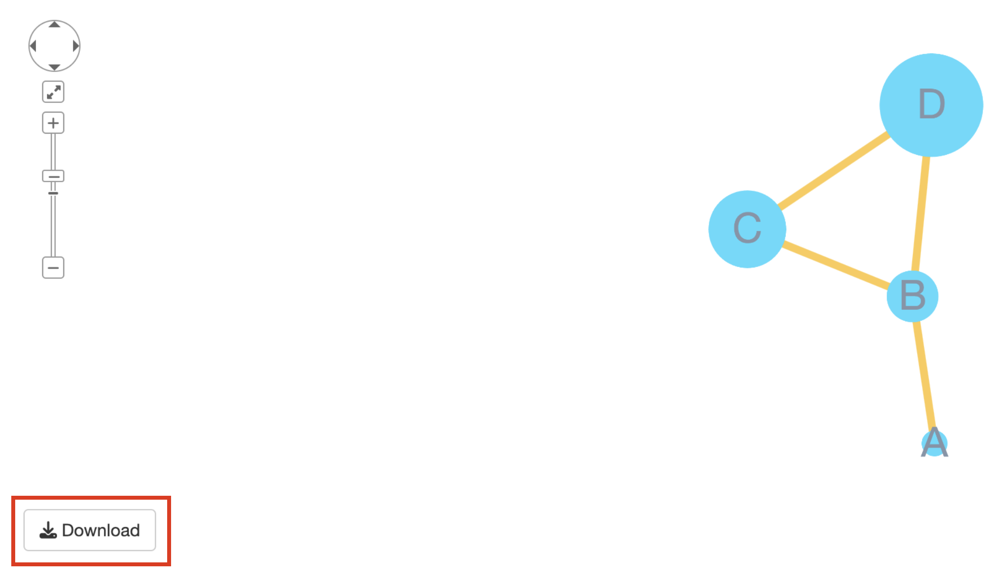

```{r, include = FALSE}
knitr::opts_chunk$set(
  collapse = TRUE,
  comment = "#>"
)
```

```{r setup, message=FALSE}
library(shiny)
library(shinyCyJS)
library(shinyjs)
```

This feature added with version `1.2.0` and only available with Shiny (not Rstudio's viewer).

Following code is minimal example to try this feature.

```{r, eval=FALSE}
ui <- function() {
  fluidPage(
    useShinyjs(), #1
    ShinyCyJSOutput(outputId = "cy"),
    actionButton('download', 'download') #2
  )
}

server <- function(input, output, session) {
  obj <- shinyCyJS(
    list(
      buildNode('a'),
      buildNode('b'),
      buildEdge('a','b')
    )
  )
  output$cy <- renderShinyCyJS(obj)
  
  observeEvent(input$download, { #3
    getPNG()
  })
}

shinyApp(ui, server)
```



To utilize `getPNG()` you should follow 3 main steps.

1. `useShinyjs()` must be included in **UI**, this will allow to run javascript code of shinyCyJS in Shiny application.
2. build `actionButton` in **UI**, however it doesn't need to name as download. 
3. `getPNG()` should be called in **server** with `observeEvent` or `eventReactive` or any other reactive function with 2's button.
Also, `getPNG()` doesn't require any argument. It will download the image with default name `cy.png`. 

